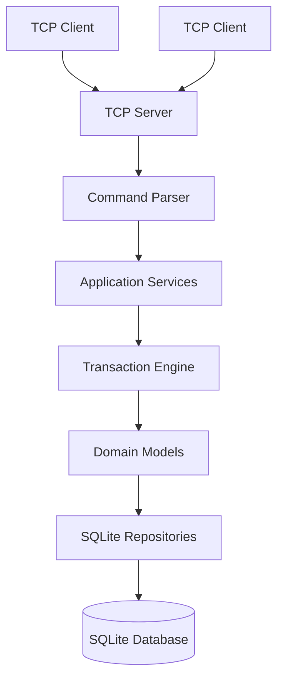

# Banking Transaction Engine - Java Implementation

A modular banking backend demonstrating Java OOP, domain modeling, concurrency, networking, persistence, security heuristics, testing, and benchmarking.
This is an independent Java implementation inspired by the original C++ project [ADD ORIGINAL C++ REPOSITORY URL].

## Features
- **Domain Modeling**: `Customer`, `Account`, `SavingsAccount`, `CurrentAccount` with explicit validation.
- **Concurrency**: Asynchronous transaction engine with `ExecutorService` and `BlockingQueue`. Thread-safe atomic transfers avoiding deadlocks.
- **Networking**: Custom cross-platform TCP server with a line-based text protocol.
- **Persistence**: SQLite persistence via JDBC with strict transactional boundaries.
- **Security**: Rule-based fraud detection heuristics and comprehensive audit logging.
- **Benchmarking**: Integrated JMH microbenchmarking harness.

## Architecture



## Technology Stack
- **Java 21**
- **Maven**
- **JUnit 5**
- **SQLite JDBC**
- **SLF4J + Logback**
- **JMH (Benchmarking)**

## Getting Started

### Prerequisites
- JDK 21+
- Maven 3.8+

### Build
```bash
./scripts/build.sh
# OR manually
mvn clean package
```

### Run Modes
This engine supports 5 modes:
1. `java -jar target/...jar in-memory-demo` (In-memory mock DB mode)
2. `java -jar target/...jar db-demo` (File-based DB demo mode)
3. `java -jar target/...jar server` (TCP Server mode using file DB)
4. `java -jar target/...jar benchmark` (JMH benchmarking mode)

### TCP Server Protocol
Start the server using `./scripts/run-server.sh`. Connect using `telnet localhost 9090`.

**Commands:**
- `CREATE_CUSTOMER <name>`
- `OPEN_ACCOUNT <customer_id> <SAVINGS|CURRENT> <initial_deposit>`
- `DEPOSIT <account_id> <amount>`
- `WITHDRAW <account_id> <amount>`
- `TRANSFER <from_id> <to_id> <amount>`
- `BALANCE <account_id>`
- `ACCOUNT <account_id>`
- `HISTORY <account_id> <limit>`
- `QUIT`

### Concurrency and Locking Strategy
Transfers employ a deterministic lock-ordering strategy based on the Account IDs (e.g. `accA.compareTo(accB)`) to prevent deadlocks when concurrently transferring between the same pair of accounts in opposite directions.

## License
MIT License
